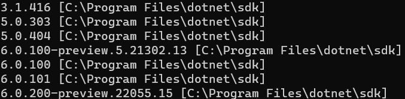

# Setup a Discord Bot using Remora
## Important Links
### Required
- [Remora.Discord (C# API to make it easier to interact with Discord's API)](https://github.com/Nihlus/Remora.Discord)
    - [Documentation Homepage](https://nihlus.github.io/Remora.Discord/)
    - [Gettting Started](https://nihlus.github.io/Remora.Discord/guides/getting-started)
    - [API Documentation](https://nihlus.github.io/Remora.Discord/api/)
    - [Undocumented Features](https://nihlus.github.io/Remora.Discord/guides/undocumented-features)
    - [Project Overview](https://nihlus.github.io/Remora.Discord/info/README)
- dotnet sdk
    - Do not install this separately if using Visual Studio 2022 or Rider
    - [.net6.0 sdk](https://dotnet.microsoft.com/en-us/download)
        - Click on your operating system and then Download .NET SDK x64 (or Arm64 if you have a new m1 chip mac)
        - If you are on Linux (or any headless machine) I suggest using the install scripts located [here](https://dotnet.microsoft.com/en-us/download/dotnet/scripts)
            - You will want to use the Bash script unless you are on Windows
    - .net5.0 is usable but not recommended, any .net
- [Entity Framework Core (Database management API)](https://docs.microsoft.com/en-us/ef/core/)
    - [Getting Started](https://docs.microsoft.com/en-us/ef/core/get-started/overview/first-app?tabs=netcore-cli)
    - [dotnet ef tool](https://docs.microsoft.com/en-us/ef/core/cli/dotnet)
        - Used for managing Entity Framework Core (Database Framework)
    - [Simple SQLite Example](https://entityframeworkcore.com/providers-sqlite)
    - [SQLite Function Mapping](https://docs.microsoft.com/en-us/ef/core/providers/sqlite/functions)
### Recommended
- [Visual Studio 2022 (Premier IDE for C# on Windows Only)](https://visualstudio.microsoft.com/vs/)
    - Alternatives
        - [Visual Studio for Mac Preview (Mac Only)](https://visualstudio.microsoft.com/vs/mac/)
        - [Visual Studio Code (Linux, macOS, Windows)](https://code.visualstudio.com/)
            - After Finished download the [C# Extension](https://marketplace.visualstudio.com/items?itemName=ms-dotnettools.csharp)
        - [Jetbrains Rider (Free with student license) (Linux, macOS, Windows)](https://www.jetbrains.com/rider/)
        - [Vim (Text Editor, technically cross platform but Unix focussed)](https://www.vim.org/)
## Getting Started
1. Download and Set up an IDE or Text Editor
    - For Windows or Mac Download Visual Studio or Rider using links above
    - For Linux download Rider or VSCode using links above
    - If you just want to use a text editor download VSCode and the C# extension using links above
        - Also download .net6.0 sdk if using this
    - If you hate yourself use vim (the superior command line text editor), emacs (if you REALLY hate yourself), or nano
        - Also download the .net6.0 sdk iif using this
2. Register bot with Discord
     - Follow DiscordJS' guide [here](https://discordjs.guide/preparations/setting-up-a-bot-application.html)
     - If the discord developer link doesn't work the first time, make sure youre logged in and keep trying the link
3. Ensure the sdk was set up properly
    - Open a terminal
        - Windows
            - Click `⊞ Win` + `r`
            - Type `cmd`
            - Type `Enter`
        - Mac
            - `Cmd` + `Alt` + `t`
        - Linux
            - If I have to explain this how do you even use linux?
    - Run `dotnet --list-sdks`
    - You should see a list like this:
    
    but probably with fewer versions, as long as one version is 6.x.x (or 5.x.x if using .net5.0) you are all set up
4. Install Entity Framework Core Tools
    - `dotnet tool install --global dotnet-ef`
        - or update existing tool with `dotnet tool update --global dotnet-ef`
5. Make your project
    - Using Visual Studio template console
    - `dotnet new console -f net6.0 -o InsertProjectNameHere` while in the folder you want to store your project folder
6. Add dependencies
    - Using Nuget via the UI
    - Using `dotnet add package InsertPackageNameHere`
    - Required Packages are `Remora.Discord`, `Microsoft.EntityFrameworkCore.Design`, `Microsoft.EntityFrameworkCore.Sqlite`, and `Microsoft.Extensions.Hosting`
7. Create a config.json
    - This will be where your token and any other private, secure information are stored. NEVER SHARE OR COMMIT THIS FILE TO A GIT REPO. If you do accidentally, revoke the key immediately and make a new one.
    - Get you token from the "Bot" section of the Discord Developer Portal
    - Click "Add Bot" Button
    - "Yes, do it!"
    - I don't know why this is so dramatic
    - Copy the token and paste it in config.json in the format below
```json
{
    "Token": "YOUR_TOKEN_HERE",
    "InviteUrl": "",
    "TestServerId": ""
}
```
8. Create a .gitignore
    - [Documentation](https://git-scm.com/docs/gitignore)
    - It should contain `config.json`
9. init git repo
    - `git init` inside folder
    - `git commit -m "Initial commit"`
10. Create configuration reader using C# JsonSerializer
11. Write Bot Setup Code replacing the token with `Configuration.ReadConfig().Token`
12. New class for slash commands